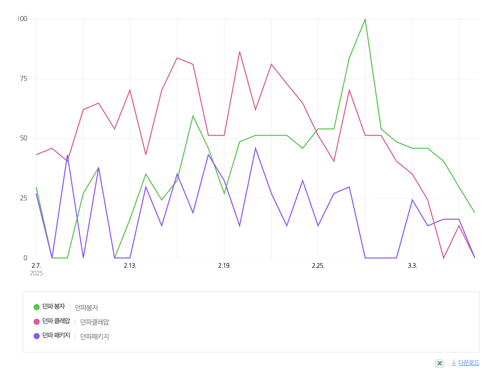
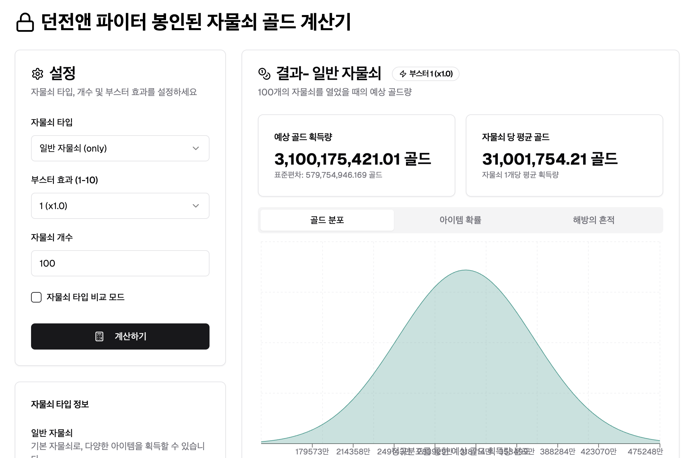

# 던락

📝 서비스 설명

던전 앤 파이터의 확률형 아이템 "봉인된 자물쇠" 와 "해방된 열쇠"사용시 얻을 수 있는 아이템 및 골드를 예측하고 플레이어들의 획득 결과를 예측합니다.

하지만 해당 아이템의 예상 골드 기대값, 아이템 획득 가능성은 "정규분포"를 따르지 않고
아이템 사용 방식또한 매우 복잡합니다.

따라서 몬테 카를로 시뮬레이션과 포아송 분포를 활용하여 아이템 사용 결과값을 표현하는 서비스를 제작하려 합니다.

📜 서비스 개요

- 단순 기대값이 아니라 아이템 사용 기믹(M 자물쇠, 부스터 등)의 영향을 반영하여 보다 현실적인 기대값을 제공
- 몬테카를로 시뮬레이션을 활용하여 플레이어가 실제로 얻을 가능성이 높은 보상 분포를 계산
- 포아송 분포를 활용하여 희소한 보상(고가 아이템) 획득 확률을 분석
- 골드 수급을 고려하는 유저를 위해 경매장 시세 변동성을 반영한 예상 수익 범위 제공

🎯 타겟 유저

- 가) 아이템 사용 기대값을 알고 싶은 유저
  "봉인된 자물쇠"와 "해방된 열쇠"를 사용하기 전에 기믹을 조합하여 보상을 최적화하고 싶은 유저

- 나) 골드 수급과 경매장 거래를 고려하는 유저
  아이템을 판매할 예정이며 획득 골드 기대값과 경매장 시세 변동을 분석하여 전략을 세우고 싶은 유저

🔎 시장조사

검색 트랜드 상으로도 꽤나 유의미한 관심도를 알수 있기에 유의미한 서비스가 될것을 기대합니다.

> 네이버 트렌드 검색

# 서비스 상세기능

> v0을 통해 생성된 예시

1. 봉인된 자물쇠 사용정보 입력 form
2. 결과 - 예상 골드 분포
3. 결과 - 해방된 흔적
4. 결과 - 아이템 확률
